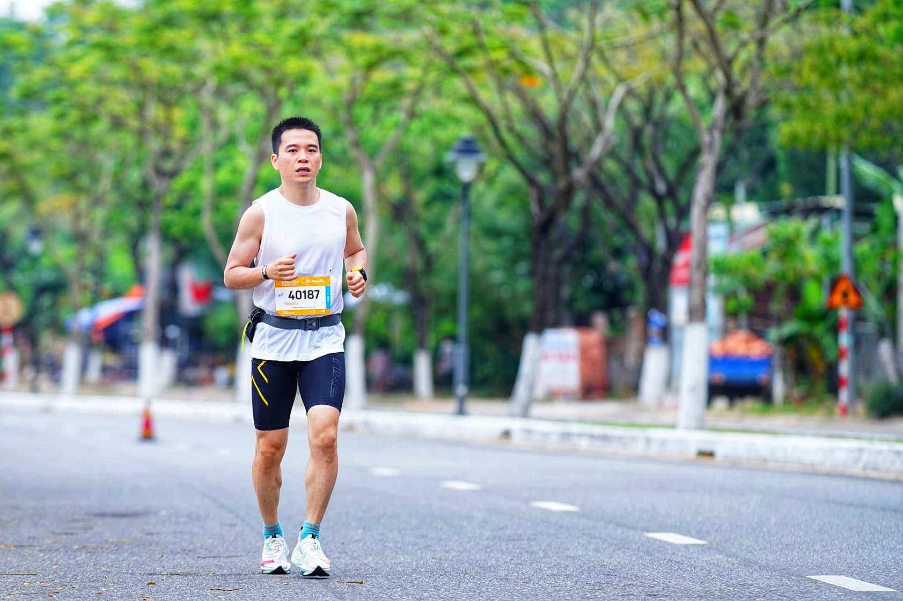

## 1. 
Sau giải VPM bị hoãn tháng 12, mình bị tụt mood, dần lười biếng hơn và hay bỏ những buổi tập. Rồi tiếp đó là Tết, việc tập luyện lại càng bị bỏ bê. Thời điểm đó, thực sự cảm thấy không muốn chạy nữa. 

Rồi 1 ngày. Cô con gái nhỏ ngồi ăn và nói chuyện với mình. 

“Con thích bố thế này”
“Hm, bố thế nào cơ ?”
“Con thích bố hiền thế này. Dạo này bố toàn mắng con.”

Mình lặng người đi. Đúng thật. Có nhiều cách để lý giải cho con : công việc của bố nhiều áp lực, cuối năm bố bận, hay con cũng đang trong giai đoạn phản kháng ... Nhưng xét cho cùng, **đổ lỗi cho hoàn cảnh cũng đâu thay đổi được sự thật** là mình gay gắt với con hơn. 

Rồi mình nghĩ lại, thì thấy thời gian mình gay gắt hơn lại trùng lặp với thời gian mình nghỉ chạy. Có thể với mình, chạy là 1 cách để giải tỏa những cảm xúc tiêu cực. 
**Luôn luôn tích cực là 1 điều không thể. Quan trọng là cách ta xử lý các cảm xúc tiêu cực.**
Chúng ta chấp nhận nó tồn tại, đối mặt, và xử lý nó. Hay cứ tìm cách chối bỏ, và canh cánh trong lòng. 
Vì thế, mình quyết định tập lại. Mục tiêu là Đà Nẵng marathon. Thời điểm đó, còn 5 tuần để tập luyện. 

## 2.
Quá trình tập luyện marathon thường sẽ rơi vào 10~14 tuần, vì sức bền không dễ cải thiện và đòi hỏi sự kiên trì. 
5 tuần chuẩn bị là rất gấp. Nhưng mình tập được 1 tuần, thì dính covid phải nghỉ thêm 1 tuần. Vậy nên tính ra chỉ còn 3 tuần tập. 

Quãng đường dài nhất cũng chỉ được 23, 24km. Lúc bị covid, đã nghĩ đến việc bỏ giải, và định cho lại suất đăng kí. Nhưng rồi vẫn chạy. Tặc lưỡi, kệ, thử thách bản thân xem được đến mức nào. 

## 3.
Đà Nẵng marathon là 1 giải khó, chạy qua 3 cái cầu 2 vòng, tổng cộng là 6 lần, với 2 lần leo cầu Thuận Phước. Ngoài ra thời điểm tháng 3 thời tiết cũng nóng, và hôm chạy nhiệt độ khoảng 24 độ. 

Và thực tế chứng minh là mình đã thất bại. Mọi người có thể thấy mình chạy hết và nghĩ rằng đó là thành công, nhưng mình là người trong cuộc, mình hiểu và thừa nhận thất bại .

Ban đầu mục tiêu của mình là 4 tiếng 15 phút, mình đã lên kế hoạch về tốc độ cho từng km. Sau khoảng 10km và leo qua cầu Thuận Phước lần thứ nhất, mình cảm thấy khá đơn giản và sung sức. Vì thế, quyết định tăng tốc để đạt mốc 4 tiếng. Mọi chuyện vẫn theo đúng kế hoạch cho đến km thứ 30. Lúc đó mình bị “đụng tường” - mức giới hạn cơ thể - và cũng trùng với đoạn leo cầu Thuận Phước lần 2. 

10km cuối, mình gần như là đi bộ. 

## 4.
10km cuối, là nỗ lực để vượt qua nỗi đau, khi mỗi bước chân là 1 sự nặng nề, đau đớn. Mình bước đi, đếm từng km. Tự nhủ lòng mình là 10km cũng không dài đâu, sáng nào mình chẳng chạy. 

Rồi anh pacer 4 tiếng 15 phút chạy qua. Anh hét lên, “cố lên em, chạy đi”. Thời gian đó 4 tiếng 15 phút đó là mục tiêu của mình. Mình cắn răng chạy theo anh, nhưng cũng chỉ được 2km là phải dừng lại. Cái cảm giác nhìn bóng lưng anh ấy chạy qua mà không thể nào đuổi theo được, khi đôi chân đã đau đớn và nặng nề, cảm giác ấy thấm thía lắm. 

## 5.

Thất bại, đau đớn, mệt mỏi. Đó là cảm giác sau 1 cuộc đua marathon. 

Nhưng trên hết, đó là 1 sự hạnh phúc nhẹ nhàng. Bản thân việc về đích, việc đạt mục tiêu kì vọng không khiến ta hạnh phúc - đó chỉ là 1 cột mốc, 1 con số. Cuộc đua không gói gọn trong 4 tiếng 27 phút 15 giây. 

Cuộc đua ấy kéo dài hơn 5 tuần, tính từ khi mình đặt quyết tâm tham dự giải, từ khi mình lên kế hoạch tập luyện cho từng ngày. Chính quá trình bền bỉ vượt qua khó khăn, theo đuổi mục tiêu, theo dõi bản thân hàng ngày, hàng tuần mới khiến chúng ta hạnh phúc. 

Nhìn rộng hơn, chính việc bước vào vùng nguy hiểm, và theo đuổi những mục tiêu mình đặt ra bằng nỗ lực, mới khiến ta hạnh phúc. 
Khi mình dừng nỗ lực, chính là lúc mình đánh mất bản thân mình, đánh mất khả năng kiểm soát cuộc sống của mình.

